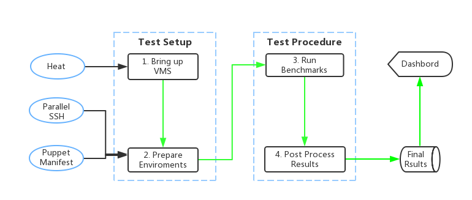

.. This work is licensed under a Creative Commons Attribution 4.0 International License.
.. http://creativecommons.org/licenses/by/4.0
.. (c) Huawei Technologies Co.,Ltd and others.

**************************
Bottlenecks Introduction
**************************

**Welcome to bottlenecks' documentation !**

.. _Bottlenecks: https://wiki.opnfv.org/bottlenecks

Bottlenecks_ is an OPNFV Project.

The project's goal is to find system bottlenecks by testing and verifying
OPNFV infrastructure in a staging environment before committing it to a production environment.
Instead of debugging a deployment in production environment,
an automatic method for executing benchmarks which plans to
validate the deployment during staging is adopted.
This project will provide frameworks to find the bottlenecks of OPNFV infrastructure.

The *Bottlenecks* framework is deployed in several  OPNFV community labs. It is
installer, infrastructure and application independent.

.. _Pharos: https://wiki.opnfv.org/pharos

.. seealso:: Pharos_ for information on OPNFV community labs.

Contact Bottlenecks
===================

Feedback? `Contact us`_

.. _Contact us: opnfv-users@lists.opnfv.org
